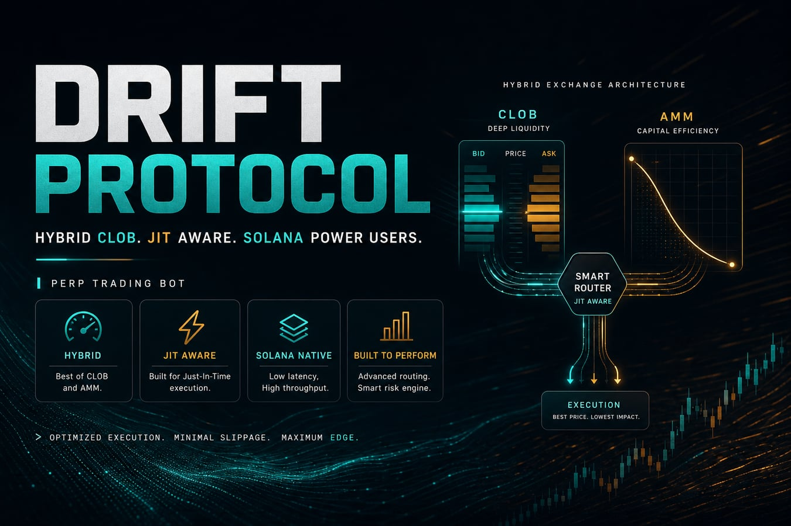
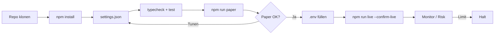
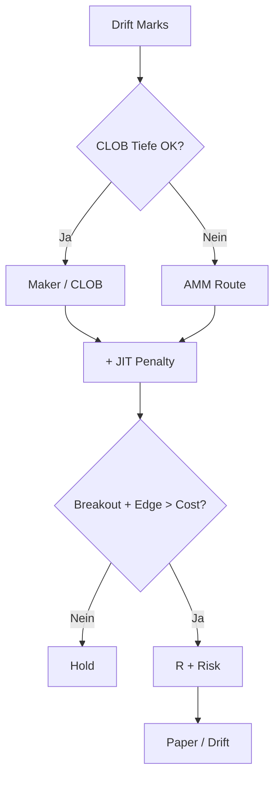

<p align="center">
  
</p>

# Drift Protocol Perp Trading Bot

<p align="center">
  <strong>Solana power-user hybrid — JIT liquidity aware perp automation</strong><br/>
  drift · Solana · paper + live · risk-gated · MIT
</p>

<p align="center">
  
  
  
  
</p>

<p align="center">
  Sprachen: [English](README.md) · [中文](README.zh.md) · **Deutsch** · [Español](README.es.md)
</p>

> **Suchbegriffe:** drift protocol bot · drift perpetual trading · Solana drift trading bot · hybrid perp DEX

---

## Projekt-Workflow

Klonen → konfigurieren → Paper → Credentials → Live. Risk immer an.



| | |
|--|--|
| `npm run paper` | Zuerst Paper — keine Keys für Simulation |
| `npm run live` | Benötigt `--confirm-live` + Venue-Credentials |

---

## Platform-Fit

| | |
|--|--|
| Venue | drift |
| Chain | Solana |
| Modell | hybrid CLOB / vAMM |
| Edge | Solana power-user hybrid — JIT liquidity aware perp automation |
| Execution | Paper-Simulator + Live-Adapter (Confirm-Gate) |

---

## Handelsstrategie

Drift = **Hybrid CLOB/vAMM** auf Solana. Bot wählt Modus mit **JIT-Penalty**: Maker bevorzugen, Kosten erhöhen wenn JIT Fills belastet — Breakout nur wenn Edge nach Penalty bleibt.

### So funktioniert es
- **Mode Select** — Maker-first wenn `preferMaker` + Tiefe ok.
- **JIT-Penalty** — `jitPenaltyBps` zu Effektivkosten.
- **Breakout** — Buffer `breakoutBufferPct`.
- **R-Exits** — Risk% + TP/SL in R.
- **Hybrid Inventory** — CLOB vs AMM tracken.
- **Risk Guardian**.

### Wann der Edge erscheint
**Bestes Regime:** aktiver CLOB, gelegentlicher AMM-Spillover, Breakouts ohne Dauer-JIT-Sturm.

### Wann es scheitert
**Scheitert bei:** persistentem JIT-Tax, Chop-Fakeouts, Unfills, RPC-Congestion.

### Schlüsselparameter (`settings.json`)
- `jitPenaltyBps`
- `breakoutBufferPct`
- `riskPerTradePct` / R-Multiples
- `preferMaker`
- `risk.*`

### Strategiespezifische Risiken
- Hybrid-Liquidität wechselt abrupt.
- Solana-Inclusion ist Teil der Strategie.
- Paper first.


---

## Strategie-Diagramm



---

## Architektur

```
src/
  config/     Zod settings + env loader
  strategy/   venue-specific engine
  broker/     paper + live adapters
  risk/       daily loss / drawdown / caps
  app/        runtime loop
  hybrid/
  jit/
  signals/
  risk/
```

---

## Schnellstart

```bash
cd drift-protocol-perp-trading-bot
npm install
npm run typecheck
npm test
npm run paper
```

### Live

```bash
cp .env.example .env
# set DRIFT_* credentials for live
npm run live
```

---

## Konfiguration

`settings.json` — strategy + risk + paper/live flags.  
`.env` — secrets only (see `.env.example`).

---

## Risiko & Sicherheit

- Live refuses without `--confirm-live` and venue credentials
- Prefer `live.dryRunOrders: true` until proven
- Never enable withdrawal / transfer permissions on trading keys
- Daily loss / drawdown / notional / leverage caps + kill switch
- On-chain: gas, RPC, sequencer, and smart-contract risk apply

---

## Haftungsausschluss

MIT-Bildungssoftware — **keine Finanzberatung**. Perp-DEX-/On-Chain-Trading kann Totalverlust bedeuten (inkl. Smart-Contract- und Liquidationsrisiko).

## Lizenz

MIT — siehe [LICENSE](LICENSE).
