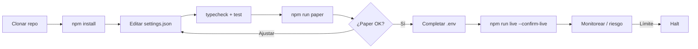
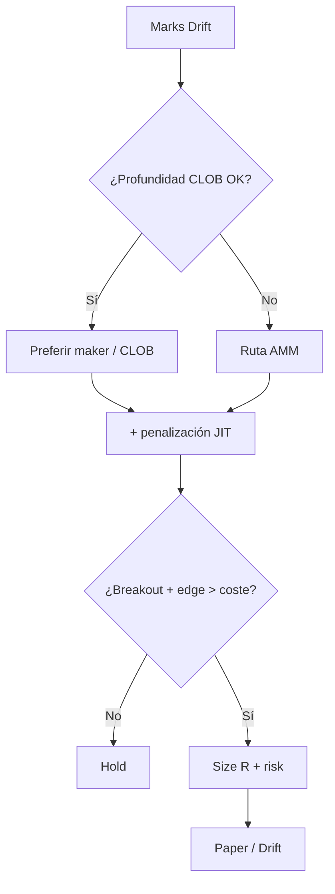

<p align="center">
  
</p>

# Drift Protocol Perp Trading Bot

<p align="center">
  <strong>Solana power-user hybrid — JIT liquidity aware perp automation</strong><br/>
  drift · Solana · paper + live · risk-gated · MIT
</p>

<p align="center">
  
  
  
  
</p>

<p align="center">
  Idiomas: [English](README.md) · [中文](README.zh.md) · [Deutsch](README.de.md) · **Español**
</p>

> **Palabras clave:** drift protocol bot · drift perpetual trading · Solana drift trading bot · hybrid perp DEX

---

## Flujo del proyecto

Clonar → configurar → paper → credenciales → live. Riesgo siempre activo.



| | |
|--|--|
| `npm run paper` | Primero paper — sin claves privadas para simulación |
| `npm run live` | Requiere `--confirm-live` + credenciales del venue |

---

## Encaje con la plataforma

| | |
|--|--|
| Venue | drift |
| Cadena | Solana |
| Modelo | hybrid CLOB / vAMM |
| Edge | Solana power-user hybrid — JIT liquidity aware perp automation |
| Ejecución | Simulador paper + adaptador live (con confirmación) |

---

## Estrategia de trading

Drift es un venue **híbrido CLOB / vAMM** en Solana. Este bot elige modo con **penalización JIT**: prefiere maker/CLOB si el libro está sano, pero suma coste efectivo si JIT empeora fills — solo toma **breakout** si el edge post-penalización sigue vivo.

### Cómo funciona
- **Selección de modo** — Maker-first si `preferMaker` y hay profundidad.
- **Penalización JIT** — Añade `jitPenaltyBps` al coste efectivo.
- **Trigger breakout** — Buffer `breakoutBufferPct`.
- **Salidas R** — Risk% + TP/SL en R.
- **Inventario híbrido** — Rastrea CLOB vs AMM.
- **Guardián de riesgo**.

### Cuándo aparece el edge
**Mejor régimen:** CLOB activo, spillover AMM ocasional, breakouts sin tormenta JIT constante.

### Cuándo se rompe
**Falla cuando:** JIT persiste, chop fakeout, unfills por preferir maker, congestión RPC.

### Parámetros clave (`settings.json`)
- `jitPenaltyBps`
- `breakoutBufferPct`
- `riskPerTradePct` / múltiplos R
- `preferMaker`
- `risk.*`

### Notas de riesgo de la estrategia
- La liquidez híbrida cambia de carácter bruscamente.
- La inclusión Solana es parte de la estrategia.
- Paper primero.


---

## Diagrama de estrategia



---

## Arquitectura

```
src/
  config/     Zod settings + env loader
  strategy/   venue-specific engine
  broker/     paper + live adapters
  risk/       daily loss / drawdown / caps
  app/        runtime loop
  hybrid/
  jit/
  signals/
  risk/
```

---

## Inicio rápido

```bash
cd drift-protocol-perp-trading-bot
npm install
npm run typecheck
npm test
npm run paper
```

### Live

```bash
cp .env.example .env
# set DRIFT_* credentials for live
npm run live
```

---

## Configuración

`settings.json` — strategy + risk + paper/live flags.  
`.env` — secrets only (see `.env.example`).

---

## Riesgo y seguridad

- Live refuses without `--confirm-live` and venue credentials
- Prefer `live.dryRunOrders: true` until proven
- Never enable withdrawal / transfer permissions on trading keys
- Daily loss / drawdown / notional / leverage caps + kill switch
- On-chain: gas, RPC, sequencer, and smart-contract risk apply

---

## Aviso legal

Software educativo MIT — **no es asesoramiento financiero**. El trading en perp DEX / on-chain puede causar pérdida total, incl. riesgo de contratos inteligentes y liquidación.

## Licencia

MIT — ver [LICENSE](LICENSE).
