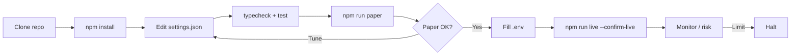
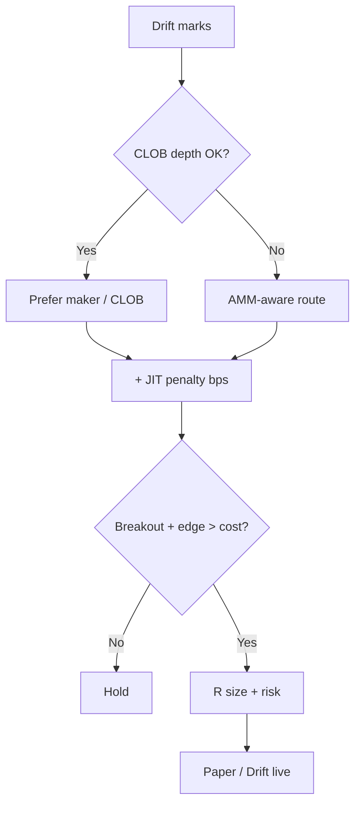

<p align="center">
  
</p>

# Drift Protocol Perp Trading Bot

<p align="center">
  <strong>Solana power-user hybrid — JIT liquidity aware perp automation</strong><br/>
  drift · Solana · paper + live · risk-gated · MIT
</p>

<p align="center">
  
  
  
  
</p>

<p align="center">
  Languages: **English** · [中文](README.zh.md) · [Deutsch](README.de.md) · [Español](README.es.md)
</p>

> **Search keywords:** drift protocol bot · drift perpetual trading · Solana drift trading bot · hybrid perp DEX

---

## Project workflow

Clone → configure → paper → credentials → live. Risk always on.



| | |
|--|--|
| `npm run paper` | Paper first — no private keys required for simulation |
| `npm run live` | Requires `--confirm-live` + venue credentials |

---

## Platform fit

| | |
|--|--|
| Venue | drift |
| Chain | Solana |
| Model | hybrid CLOB / vAMM |
| Edge | Solana power-user hybrid — JIT liquidity aware perp automation |
| Execution | Paper simulator + live venue adapter (confirm-gated) |

---

## Trading strategy

Drift is a **hybrid CLOB / vAMM** power-user venue on Solana. This bot chooses execution mode with a **JIT penalty**: prefer maker/CLOB when the book is healthy, but widen effective cost when JIT liquidity would tax fills — then only take **breakout** risk if the post-penalty edge still clears. Edge = hybrid awareness, not raw signal spam.

### How it works
- **Mode select** — Prefer maker path when `preferMaker` is true and CLOB depth looks adequate; else route with AMM awareness.
- **JIT penalty** — Add `jitPenaltyBps` to effective cost when JIT would worsen fills; skip if edge < cost.
- **Breakout trigger** — Enter when price clears range by `breakoutBufferPct`.
- **R exits** — Size with `riskPerTradePct`; manage with `takeProfitR` / `stopLossR`.
- **Hybrid inventory** — Track whether fills came via CLOB vs AMM for analytics and risk.
- **Risk guardian** — Daily loss / drawdown / notional / kill-switch before any paper or live send.

### When the edge appears
**Best regime:** Solana perps with active CLOB plus occasional AMM spillover — enough volatility for breakouts, but not constant JIT storms that erase edge.

### When it breaks down
**Fails when:** JIT persistently taxes every fill, breakouts fake out in chop, maker preference leaves you unfilled into a move, or RPC congestion delays cancels.

### Key parameters (`settings.json`)
- `strategy.jitPenaltyBps` — cost add-on when JIT is adverse
- `strategy.breakoutBufferPct` — breakout arming buffer
- `strategy.riskPerTradePct`, `takeProfitR`, `stopLossR`
- `strategy.preferMaker` — maker-first routing bias
- `risk.*` — hard portfolio brakes

### Strategy-specific risk notes
- Hybrid venues can switch liquidity character abruptly; size for the worse mode.
- Solana inclusion risk is part of the strategy, not an afterthought.
- Paper first; live only with confirm + tiny notional.


---

## Strategy diagram



---

## Architecture

```
src/
  config/     Zod settings + env loader
  strategy/   venue-specific engine
  broker/     paper + live adapters
  risk/       daily loss / drawdown / caps
  app/        runtime loop
  hybrid/
  jit/
  signals/
  risk/
```

---

## Quickstart

```bash
cd drift-protocol-perp-trading-bot
npm install
npm run typecheck
npm test
npm run paper
```

### Live

```bash
cp .env.example .env
# set DRIFT_* credentials for live
npm run live
```

---

## Configuration

`settings.json` — strategy + risk + paper/live flags.  
`.env` — secrets only (see `.env.example`).

---

## Risk & safety

- Live refuses without `--confirm-live` and venue credentials
- Prefer `live.dryRunOrders: true` until proven
- Never enable withdrawal / transfer permissions on trading keys
- Daily loss / drawdown / notional / leverage caps + kill switch
- On-chain: gas, RPC, sequencer, and smart-contract risk apply

---

## Disclaimer

Educational MIT software — **not financial advice**. Perp DEX / on-chain trading can cause total loss of capital, including smart-contract and liquidation risk.

## License

MIT — see [LICENSE](LICENSE).
