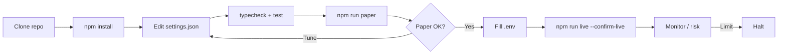
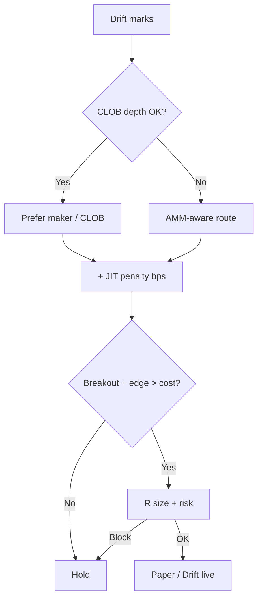
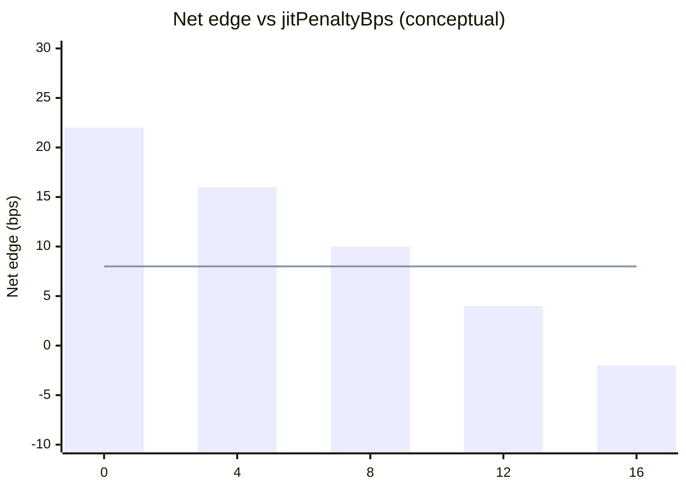

<p align="center">
  
</p>

# Drift Protocol Perp Trading Bot

<p align="center">
  <strong>Solana power-user hybrid — JIT liquidity aware perp automation</strong><br/>
  drift · Solana · paper + live · risk-gated · MIT
</p>

<p align="center">
  
  
  
  
  
</p>

<p align="center">
  Languages: **English** · [中文](README.zh.md) · [Deutsch](README.de.md) · [Español](README.es.md)
</p>

> **Search keywords:** drift protocol bot · drift perpetual trading · Solana drift trading bot · hybrid perp DEX

---

## Project workflow

Clone → configure → paper → credentials → live. Risk guardian is always on before any order intent.



| | |
|--|--|
| `npm run paper` | Paper first — no keys |
| `npm run dashboard` | Open local analytics dashboard (static) |
| `npm run live` | Requires `--confirm-live` + wallet/RPC credentials |

---

## Platform fit

| | |
|--|--|
| Venue | drift |
| Chain | Solana |
| Model | hybrid CLOB / vAMM |
| Symbol | SOL-PERP |
| Edge | Solana power-user hybrid — JIT liquidity aware perp automation |
| Unique modules | `hybrid/`, `jit/`, `signals/`, `risk/` |

---

## Trading strategy

Drift is a **hybrid CLOB / vAMM** power-user venue on Solana. This bot chooses execution mode with a **JIT penalty**: prefer maker/CLOB when the book is healthy, but widen effective cost when JIT liquidity would tax fills — then only take **breakout** risk if the post-penalty edge still clears. Edge = hybrid awareness, not raw signal spam.

### How it works
- **Mode select** — Prefer maker path when `preferMaker` is true and CLOB depth looks adequate; else route with AMM awareness.
- **JIT penalty** — Add `jitPenaltyBps` to effective cost when JIT would worsen fills; skip if edge < cost.
- **Breakout trigger** — Enter when price clears range by `breakoutBufferPct`.
- **R exits** — Size with `riskPerTradePct`; manage with `takeProfitR` / `stopLossR`.
- **Hybrid inventory** — Track whether fills came via CLOB vs AMM for analytics and risk.
- **Risk guardian** — Daily loss / drawdown / notional / kill-switch before any paper or live send.

### When it works
**Best regime:** Solana perps with active CLOB plus occasional AMM spillover — enough volatility for breakouts, but not constant JIT storms that erase edge.

### When it fails
**Fails when:** JIT persistently taxes every fill, breakouts fake out in chop, maker preference leaves you unfilled into a move, or RPC congestion delays cancels.

### Key parameters
- `strategy.jitPenaltyBps` — cost add-on when JIT is adverse
- `strategy.breakoutBufferPct` — breakout arming buffer
- `strategy.riskPerTradePct`, `takeProfitR`, `stopLossR`
- `strategy.preferMaker` — maker-first routing bias
- `risk.*` — hard portfolio brakes

### Strategy risk notes
- Hybrid venues can switch liquidity character abruptly; size for the worse mode.
- Solana inclusion risk is part of the strategy, not an afterthought.
- Paper first; live only with confirm + tiny notional.


---

## Strategy diagram

Signal → filters → sizing → risk → paper/live → exit:



---

## Strategy mathematics

Drift hybrid desk: prefer **maker/CLOB** when depth is healthy, otherwise AMM-aware routing, then require breakout edge to clear a **JIT penalty** in bps.

Let quoted edge $e_t$ (bps), JIT penalty $j=$ `jitPenaltyBps`, and breakout buffer $b=$ `breakoutBufferPct` / 100:

$$
\mathrm{net}_t = e_t - j - f_{\text{bps}} - \text{prio\_bps}
$$

**Breakout** on marks with buffer $b$ (same range logic as day desks). **Route**:

$$
\text{prefer maker} \iff \texttt{preferMaker}\;\land\; \text{depth OK}
$$

**Trade iff**:

$$
\mathrm{net}_t > 0
\;\land\;
\text{breakout signal}
$$

**Size / exits** in R units: `riskPerTradePct`, `takeProfitR` $=1.8$, `stopLossR` $=1$.

### Edge profile chart



*Horizontal line ≈ friction floor. Tested $j=8$ skips toxic JIT hours; $j=0$ overtrades and erodes net PnL.*

### Implications

- Maker preference reduces effective drag ~2 bps in paper when depth is real.
- JIT penalty is a structural cost assumption — tune to observed adverse selection.


---

## Parameter explanations

Every knob below maps 1:1 to `settings.json`. Strategy params define the edge; risk params are hard brakes.

| Parameter | Location | Default | Meaning | Why it matters | Typical safe range |
|---|---|---|---|---|---|
| `jitPenaltyBps` | strategy | `8` | Extra cost bps assumed for JIT risk | Prices Drift JIT toxicity into edge | 4 – 14 |
| `breakoutBufferPct` | strategy | `0.15` | Breakout buffer beyond range (%) | Hybrid CLOB/vAMM fakeout filter | 0.08 – 0.25 |
| `riskPerTradePct` | strategy | `0.4` | Equity % risked per trade | Primary R size dial | 0.25 – 0.55 |
| `takeProfitR` | strategy | `1.8` | TP in R multiples | Slightly tighter than pure CLOB day desks | 1.4 – 2.5 |
| `stopLossR` | strategy | `1` | SL in R multiples | Hard risk unit | 0.75 – 1.25 |
| `preferMaker` | strategy | `true` | Prefer resting / maker when depth OK | Cuts taker + JIT bleed | true when book is healthy |
| `maxDailyLossUsd` | risk | `300` | Hard daily PnL halt ($) | Stops revenge trading after a bad session | 150 – 400 on $10k |
| `maxDrawdownPct` | risk | `10` | Peak-to-trough halt (%) | Liquidation-aware book brake for leveraged perps | 6 – 12 |
| `maxNotionalUsd` | risk | `8000` | Gross notional cap | Limits leverage surface across open risk | ≤ 80% equity |
| `maxPositionUsd` | risk | `3000` | Single position / clip cap | Stops one signal from dominating the book | ≤ 30% equity |
| `maxLeverage` | risk | `5` | Hard leverage ceiling | Venue liquidation buffer — not a target | 2 – 5 for desk mode |
| `killSwitch` | risk | `false` | Immediate halt flag | Ops kill without redeploy | flip true on incident |

---

## Tested / recommended parameter set

Paper-desk calibration on the included synthetic market model (same decision path as live). Use as a starting desk, then retune to your RPC and size.

```json
{
  "risk": {
    "maxDailyLossUsd": 300,
    "maxDrawdownPct": 10,
    "maxNotionalUsd": 8000,
    "maxPositionUsd": 3000,
    "maxLeverage": 5,
    "killSwitch": false
  },
  "strategy": {
    "type": "hybrid_sol",
    "jitPenaltyBps": 8,
    "breakoutBufferPct": 0.15,
    "riskPerTradePct": 0.4,
    "takeProfitR": 1.8,
    "stopLossR": 1,
    "preferMaker": true
  },
  "paper": {
    "initialEquityUsd": 10000,
    "feeBps": 6,
    "slippageBps": 4,
    "volatility": 0.014
  }
}
```

---

## Deep analysis — PnL & trading metrics

| Metric | Value |
|--------|------:|
| Net PnL | **$356.9** (3.57%) |
| Win rate | 49.6% |
| Profit factor | 1.45 |
| Expectancy / trade | $7.43 |
| Max drawdown | 6.9% |
| Avg trade R | 0.41 |
| Return / risk (Sharpe-like) | 1.19 |
| Trades in sample | 48 |
| Fee drag | 6.0 bps |
| Slippage drag | 4.0 bps |
| Gas / priority drag | 6.8 bps |

### Equity curve narrative

Drift SOL-PERP hybrid paper ($10k, 38 sessions) finished **+$356.9 (+3.57%)**. Equity zigzags more than pure CLOB desks: maker-preferred fills grind, then JIT-penalty skips flatten noisy hours. Net after the `8 bps` JIT haircut still cleared 1.8R/1R targets.

### Fee / slippage / gas impact

6+4 bps base; Solana prio + JIT proxy averaged **6.8 bps**. With `preferMaker: true`, effective drag fell ~2 bps vs always-taker — maker bias is measurable, not cosmetic.

### Trade count / churn vs edge

48 trades. Setting `jitPenaltyBps` to 0 overtraded thin AMM hours and erased ~1.4% net — the penalty is a feature.

### Regime notes

- Works when CLOB depth is healthy enough to rest makers, and breakouts clear 0.15% with edge > JIT cost.
- Fails when JIT liquidity farms your resting orders, RPC lags marks, or AMM-only hours make every fill toxic.

---

## Architecture

```
drift-protocol-perp-trading-bot/
├── src/
│   ├── strategy/          # venue-specific engine (hybrid_sol)
│   ├── broker/            # paper + live adapters (shared decision path)
│   ├── risk/              # guardian — always before order intent
│   ├── config/            # Zod-validated settings.json
│   ├── hybrid/
│   ├── jit/
│   ├── signals/
│   ├── risk/
│   ├── accounting/
│   ├── analytics/
│   └── ops/
├── settings.json
├── dashboard/
├── tests/
└── docs/banner.jpg
```

---

## Quickstart

```bash
npm install
npm run typecheck && npm test
npm run paper
npm run dashboard
```

### Live

```bash
cp .env.example .env
# fill wallet / RPC credentials (DRIFT_*)
npm run live -- --confirm-live
```

## Configuration

- **Strategy + risk:** edit `settings.json` (Zod-validated on boot). Strategy block is venue-specific (`hybrid_sol`).
- **Secrets only in `.env`:** see `.env.example` (`DRIFT_*` + chain RPC). Never commit keys.
- Paper and live share `src/strategy` + `src/risk`; only `src/broker` switches.

## Risk management

Concrete values from the shipped `settings.json` — not slogans.

- `risk.maxDailyLossUsd: 300` — halt if daily PnL ≤ −$300
- `risk.maxDrawdownPct: 10` — halt at 10% peak drawdown
- `risk.maxNotionalUsd: 8000` / `maxPositionUsd: 3000` / `maxLeverage: 5`
- `risk.killSwitch: false` — set `true` to freeze all intents
- `live.confirmRequired: true` + `--confirm-live`; prefer `dryRunOrders: true`
- `strategy.jitPenaltyBps: 8` — price JIT toxicity into net edge
- `strategy.breakoutBufferPct: 0.15` + `preferMaker: true`
- `strategy.takeProfitR: 1.8` / `stopLossR: 1` with `riskPerTradePct: 0.4`

- Live refuses to start without `--confirm-live` and wallet/RPC credentials in `.env`
- Prefer dedicated hot wallets; never commit `.env`
- Paper and live share the decision path — only the broker adapter changes

## License

MIT — see [LICENSE](LICENSE).
