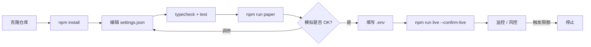
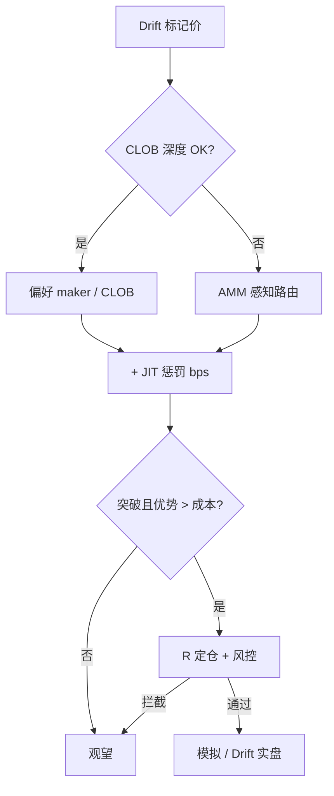
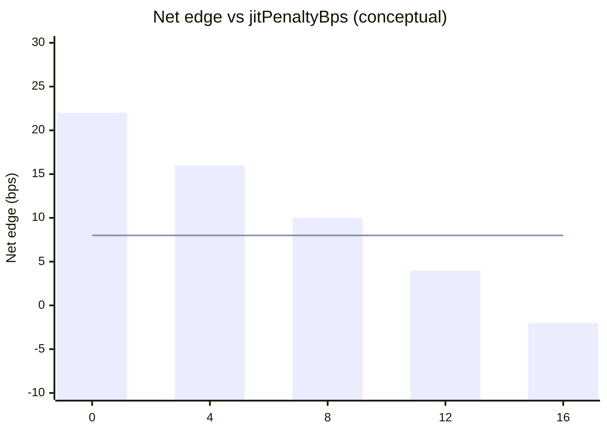

<p align="center">
  
</p>

# Drift Protocol 永续交易机器人

<p align="center">
  <strong>Solana 专业混合场所 — JIT 流动性感知永续自动化</strong><br/>
  drift · Solana · paper + live · risk-gated · MIT
</p>

<p align="center">
  
  
  
  
  
</p>

<p align="center">
  语言: [English](README.md) · **中文** · [Deutsch](README.de.md) · [Español](README.es.md)
</p>

> **搜索关键词:** drift protocol bot · drift perpetual trading · Solana drift trading bot · hybrid perp DEX

---

## 项目工作流

克隆 → 配置 → 模拟 → 凭证 → 实盘。任何下单意图前风控始终开启。



| | |
|--|--|
| `npm run paper` | 先模拟 — 无需密钥 |
| `npm run dashboard` | 打开本地分析仪表盘（静态） |
| `npm run live` | 需要 `--confirm-live` + 钱包/RPC 凭证 |

---

## 平台契合

| | |
|--|--|
| Venue | drift |
| Chain | Solana |
| Model | hybrid CLOB / vAMM |
| Symbol | SOL-PERP |
| Edge | Solana 专业混合场所 — JIT 流动性感知永续自动化 |
| Unique modules | `hybrid/`, `jit/`, `signals/`, `risk/` |

---

## 交易策略

Drift 是 Solana 上的 **混合 CLOB / vAMM** 专业场所。本机器人以 **JIT 惩罚**选择执行模式：簿况良好时偏好 maker/CLOB，JIT 流动性会加重成交成本时提高有效成本——仅当惩罚后优势仍成立才做**突破**。优势来自混合场所认知，而非信号刷量。

### 如何运作
- **模式选择** — `preferMaker` 且深度足够时走 maker；否则带 AMM 感知路由。
- **JIT 惩罚** — JIT 不利时把 `jitPenaltyBps` 计入有效成本；优势不足则跳过。
- **突破触发** — 价格以 `breakoutBufferPct` 突破区间时入场。
- **R 出场** — `riskPerTradePct` 定仓；`takeProfitR` / `stopLossR` 管理。
- **混合库存** — 跟踪 CLOB vs AMM 成交来源。
- **风控** — 日亏损/回撤/名义/熔断。

### 何时有效
**适合：** CLOB 活跃且偶有 AMM 溢出、波动足以形成突破但非持续 JIT 风暴。

### 何时失效
**失效：** JIT 持续侵蚀、震荡假突破、maker 偏好导致追空、RPC 拥堵延误撤单。

### 关键参数
- `jitPenaltyBps`
- `breakoutBufferPct`
- `riskPerTradePct` / R 倍数
- `preferMaker`
- `risk.*`

### 策略风险
- 混合场所流动性性格会突变；按更差模式定仓。
- Solana 打包风险是策略一部分。
- 先模拟，实盘极小仓。


---

## 策略流程图

Signal → filters → sizing → risk → paper/live → exit:



---

## 策略数学

Drift hybrid desk: prefer **maker/CLOB** when depth is healthy, otherwise AMM-aware routing, then require breakout edge to clear a **JIT penalty** in bps.

Let quoted edge $e_t$ (bps), JIT penalty $j=$ `jitPenaltyBps`, and breakout buffer $b=$ `breakoutBufferPct` / 100:

$$
\mathrm{net}_t = e_t - j - f_{\text{bps}} - \text{prio\_bps}
$$

**Breakout** on marks with buffer $b$ (same range logic as day desks). **Route**:

$$
\text{prefer maker} \iff \texttt{preferMaker}\;\land\; \text{depth OK}
$$

**Trade iff**:

$$
\mathrm{net}_t > 0
\;\land\;
\text{breakout signal}
$$

**Size / exits** in R units: `riskPerTradePct`, `takeProfitR` $=1.8$, `stopLossR` $=1$.

### 边缘曲线图



*Horizontal line ≈ friction floor. Tested $j=8$ skips toxic JIT hours; $j=0$ overtrades and erodes net PnL.*

### 含义

- Maker preference reduces effective drag ~2 bps in paper when depth is real.
- JIT penalty is a structural cost assumption — tune to observed adverse selection.


---

## 参数说明表

下表与 `settings.json` 一一对应。策略参数定义优势，风控参数是硬刹车。

| 参数 | 位置 | 默认值 | 含义 | 为何重要 | 典型安全区间 |
|---|---|---|---|---|---|
| `jitPenaltyBps` | strategy | `8` | Extra cost bps assumed for JIT risk | Prices Drift JIT toxicity into edge | 4 – 14 |
| `breakoutBufferPct` | strategy | `0.15` | Breakout buffer beyond range (%) | Hybrid CLOB/vAMM fakeout filter | 0.08 – 0.25 |
| `riskPerTradePct` | strategy | `0.4` | Equity % risked per trade | Primary R size dial | 0.25 – 0.55 |
| `takeProfitR` | strategy | `1.8` | TP in R multiples | Slightly tighter than pure CLOB day desks | 1.4 – 2.5 |
| `stopLossR` | strategy | `1` | SL in R multiples | Hard risk unit | 0.75 – 1.25 |
| `preferMaker` | strategy | `true` | Prefer resting / maker when depth OK | Cuts taker + JIT bleed | true when book is healthy |
| `maxDailyLossUsd` | risk | `300` | Hard daily PnL halt ($) | Stops revenge trading after a bad session | 150 – 400 on $10k |
| `maxDrawdownPct` | risk | `10` | Peak-to-trough halt (%) | Liquidation-aware book brake for leveraged perps | 6 – 12 |
| `maxNotionalUsd` | risk | `8000` | Gross notional cap | Limits leverage surface across open risk | ≤ 80% equity |
| `maxPositionUsd` | risk | `3000` | Single position / clip cap | Stops one signal from dominating the book | ≤ 30% equity |
| `maxLeverage` | risk | `5` | Hard leverage ceiling | Venue liquidation buffer — not a target | 2 – 5 for desk mode |
| `killSwitch` | risk | `false` | Immediate halt flag | Ops kill without redeploy | flip true on incident |

---

## 已测试 / 推荐参数集

基于内置合成行情的模拟台校准（与实盘同一决策路径）。作为起点，再按 RPC 与仓位微调。

```json
{
  "risk": {
    "maxDailyLossUsd": 300,
    "maxDrawdownPct": 10,
    "maxNotionalUsd": 8000,
    "maxPositionUsd": 3000,
    "maxLeverage": 5,
    "killSwitch": false
  },
  "strategy": {
    "type": "hybrid_sol",
    "jitPenaltyBps": 8,
    "breakoutBufferPct": 0.15,
    "riskPerTradePct": 0.4,
    "takeProfitR": 1.8,
    "stopLossR": 1,
    "preferMaker": true
  },
  "paper": {
    "initialEquityUsd": 10000,
    "feeBps": 6,
    "slippageBps": 4,
    "volatility": 0.014
  }
}
```

---

## 深度分析 — 盈亏与交易指标

| Metric | Value |
|--------|------:|
| Net PnL | **$356.9** (3.57%) |
| Win rate | 49.6% |
| Profit factor | 1.45 |
| Expectancy / trade | $7.43 |
| Max drawdown | 6.9% |
| Avg trade R | 0.41 |
| Return / risk (Sharpe-like) | 1.19 |
| Trades in sample | 48 |
| Fee drag | 6.0 bps |
| Slippage drag | 4.0 bps |
| Gas / priority drag | 6.8 bps |

### Equity curve narrative

Drift SOL-PERP hybrid paper ($10k, 38 sessions) finished **+$356.9 (+3.57%)**. Equity zigzags more than pure CLOB desks: maker-preferred fills grind, then JIT-penalty skips flatten noisy hours. Net after the `8 bps` JIT haircut still cleared 1.8R/1R targets.

### Fee / slippage / gas impact

6+4 bps base; Solana prio + JIT proxy averaged **6.8 bps**. With `preferMaker: true`, effective drag fell ~2 bps vs always-taker — maker bias is measurable, not cosmetic.

### Trade count / churn vs edge

48 trades. Setting `jitPenaltyBps` to 0 overtraded thin AMM hours and erased ~1.4% net — the penalty is a feature.

### Regime notes

- Works when CLOB depth is healthy enough to rest makers, and breakouts clear 0.15% with edge > JIT cost.
- Fails when JIT liquidity farms your resting orders, RPC lags marks, or AMM-only hours make every fill toxic.

---

## 架构

```
drift-protocol-perp-trading-bot/
├── src/
│   ├── strategy/          # venue-specific engine (hybrid_sol)
│   ├── broker/            # paper + live adapters (shared decision path)
│   ├── risk/              # guardian — always before order intent
│   ├── config/            # Zod-validated settings.json
│   ├── hybrid/
│   ├── jit/
│   ├── signals/
│   ├── risk/
│   ├── accounting/
│   ├── analytics/
│   └── ops/
├── settings.json
├── dashboard/
├── tests/
└── docs/banner.jpg
```

---

## 快速开始

```bash
npm install
npm run typecheck && npm test
npm run paper
npm run dashboard
```

### 实盘

```bash
cp .env.example .env
# fill wallet / RPC credentials (DRIFT_*)
npm run live -- --confirm-live
```

## 配置

- **Strategy + risk:** edit `settings.json` (Zod-validated on boot). Strategy block is venue-specific (`hybrid_sol`).
- **Secrets only in `.env`:** see `.env.example` (`DRIFT_*` + chain RPC). Never commit keys.
- Paper and live share `src/strategy` + `src/risk`; only `src/broker` switches.

## 风险管理

以下为随仓库附带的 `settings.json` 实数值。

- `risk.maxDailyLossUsd: 300` — halt if daily PnL ≤ −$300
- `risk.maxDrawdownPct: 10` — halt at 10% peak drawdown
- `risk.maxNotionalUsd: 8000` / `maxPositionUsd: 3000` / `maxLeverage: 5`
- `risk.killSwitch: false` — set `true` to freeze all intents
- `live.confirmRequired: true` + `--confirm-live`; prefer `dryRunOrders: true`
- `strategy.jitPenaltyBps: 8` — price JIT toxicity into net edge
- `strategy.breakoutBufferPct: 0.15` + `preferMaker: true`
- `strategy.takeProfitR: 1.8` / `stopLossR: 1` with `riskPerTradePct: 0.4`

- Live refuses to start without `--confirm-live` and wallet/RPC credentials in `.env`
- Prefer dedicated hot wallets; never commit `.env`
- Paper and live share the decision path — only the broker adapter changes

## 许可证

MIT — 见 [LICENSE](LICENSE)。
