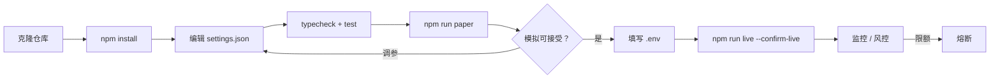
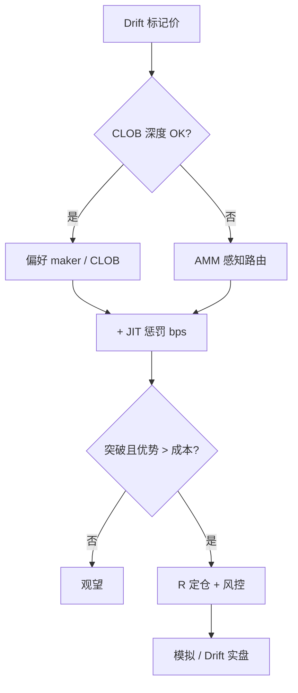

<p align="center">
  
</p>

# Drift Protocol 永续交易机器人

<p align="center">
  <strong>Solana 专业混合场所 — JIT 流动性感知永续自动化</strong><br/>
  drift · Solana · paper + live · risk-gated · MIT
</p>

<p align="center">
  
  
  
  
</p>

<p align="center">
  语言: [English](README.md) · **中文** · [Deutsch](README.de.md) · [Español](README.es.md)
</p>

> **搜索关键词:** drift protocol bot · drift perpetual trading · Solana drift trading bot · hybrid perp DEX

---

## 项目工作流

克隆 → 配置 → 模拟 → 凭证 → 实盘。风控始终开启。



| | |
|--|--|
| `npm run paper` | 先跑模拟盘 — 模拟无需私钥 |
| `npm run live` | 需要 `--confirm-live` 与场所凭证 |

---

## 平台契合点

| | |
|--|--|
| 场所 | drift |
| 链 | Solana |
| 模型 | hybrid CLOB / vAMM |
| 优势定位 | Solana 专业混合场所 — JIT 流动性感知永续自动化 |
| 执行 | 模拟盘 + 实盘场所适配器（确认闸门） |

---

## 交易策略

Drift 是 Solana 上的 **混合 CLOB / vAMM** 专业场所。本机器人以 **JIT 惩罚**选择执行模式：簿况良好时偏好 maker/CLOB，JIT 流动性会加重成交成本时提高有效成本——仅当惩罚后优势仍成立才做**突破**。优势来自混合场所认知，而非信号刷量。

### 如何运作
- **模式选择** — `preferMaker` 且深度足够时走 maker；否则带 AMM 感知路由。
- **JIT 惩罚** — JIT 不利时把 `jitPenaltyBps` 计入有效成本；优势不足则跳过。
- **突破触发** — 价格以 `breakoutBufferPct` 突破区间时入场。
- **R 出场** — `riskPerTradePct` 定仓；`takeProfitR` / `stopLossR` 管理。
- **混合库存** — 跟踪 CLOB vs AMM 成交来源。
- **风控** — 日亏损/回撤/名义/熔断。

### 优势出现的条件
**适合：** CLOB 活跃且偶有 AMM 溢出、波动足以形成突破但非持续 JIT 风暴。

### 何时失效
**失效：** JIT 持续侵蚀、震荡假突破、maker 偏好导致追空、RPC 拥堵延误撤单。

### 关键参数（`settings.json`）
- `jitPenaltyBps`
- `breakoutBufferPct`
- `riskPerTradePct` / R 倍数
- `preferMaker`
- `risk.*`

### 策略特有风险提示
- 混合场所流动性性格会突变；按更差模式定仓。
- Solana 打包风险是策略一部分。
- 先模拟，实盘极小仓。


---

## 策略流程图



---

## 架构

```
src/
  config/     Zod settings + env loader
  strategy/   venue-specific engine
  broker/     paper + live adapters
  risk/       daily loss / drawdown / caps
  app/        runtime loop
  hybrid/
  jit/
  signals/
  risk/
```

---

## 快速开始

```bash
cd drift-protocol-perp-trading-bot
npm install
npm run typecheck
npm test
npm run paper
```

### 实盘

```bash
cp .env.example .env
# set DRIFT_* credentials for live
npm run live
```

---

## 配置

`settings.json` — strategy + risk + paper/live flags.  
`.env` — secrets only (see `.env.example`).

---

## 风险与安全

- Live refuses without `--confirm-live` and venue credentials
- Prefer `live.dryRunOrders: true` until proven
- Never enable withdrawal / transfer permissions on trading keys
- Daily loss / drawdown / notional / leverage caps + kill switch
- On-chain: gas, RPC, sequencer, and smart-contract risk apply

---

## 免责声明

MIT 教育软件 — **不构成投资建议**。永续 DEX / 链上交易可能导致本金全部损失，含智能合约与爆仓风险。

## 许可证

MIT — 见 [LICENSE](LICENSE)。
